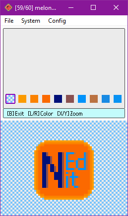
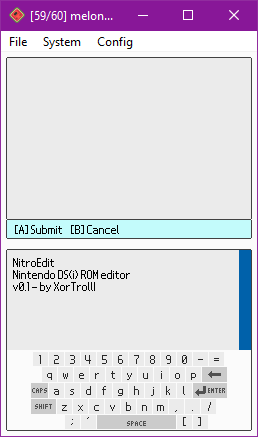
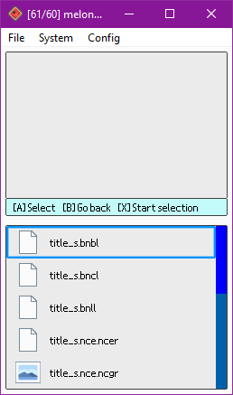

# NitroEdit

> Nintendo DS(i) ROM/format editor, but for the Nintendo DS(i) consoles themselves (**PoC**)

This project is the result of bringing the concept of already existing Nintendo DS(i) ROM editors to the DS(i) consoles themselves. Despite obvious limitations, one can make custom edits of ROMs with the simplicity and the portability of this console family.

The editor is usable and has basic support for some well-known formats, although it can get slow when performing saving operations. Note that this is mostly a proof of concept showcasing the (cursed) idea.

## Supported formats

### NDS(i) ROMs

- View/edit info (game title, game code, maker code)

- View/edit icon

- Browse it's NitroFs filesystem

### Archives (NARC, CARC, DWC utility files, etc.)

- Browse it's NitroFs filesystem

### NCGR, NCLR, NSCR

- View/edit the texture formed by NCGR + NCLR

- View the texture formed by a NCGR + NCLR + NSCR (saving is not supported yet)

### SDAT (plus SWAR, SWAV)

- Explore wave archives (SWAR) and their wave samples

- Play/edit those wave samples (SWAV), recording with the console's microphone!

### BMG

- View/edit strings

## Building

Like with most DS(i) homebrew projects, this project basically requires devkitARM, libnds, and the other basic DS homebrew libraries to be installed (check the `nds-dev` package in devKitPro `pacman`). Then, running `make` will compile the project into a final NDS ROM.

## TODO

### Editing

- Implement saving texture as NCGR+NCLR+NSCR

- Implement saving in utility.bin files

- Support other formats within SDATs (STRM, SSEQ, etc.)

- Models and model textures (NSBMD, NSBTX)

- Support for remaining BMG message encodings

- Proper BMG special character support for messages using it

- For multiple palette NCGR+NCLR textures, allow choosing the palette to load

- Support ignored attributes in NSCR data (check the links credited below)

- Support PMCP section in NCLRs

### UI/overall

- Try to improve loading/saving times, but can't do much better due to technical limitations...

- Consider using direct framebuffer drawing instead of using sprites

- Consider using specially converted textures instead of loading PNGs

- Support for exporting files/directories to some output directory (like GodMode9 does)

- Polish graphics in general

- Detect file formats with a better system than just checking the extension (checking headers, etc.) (done in libnedit)

- Support for NSBTX editing

- Implement zoom for large textures in the graphic editor

- Allow changing colors in the color palette in the graphic editor

- Add hex/text editors/viewers?

- File exporting and importing support from NitroFs filesystems?

- Support more special characters (é, à, etc.) on the keyboard

- Use special icon for compressed files

(And many more things that could be added here)

## Support

Any suggestions, ideas and contributions are always welcome, but keep in mind that this just a proof of concept.

## Credits

- [devkitPro](https://github.com/devkitPro)'s devkitARM and various DS libraries are the basic components in order to make this project and most other DS(i) homebrew projects.

- Some already existing PC ROM editors were really helpful in order to understand several file formats, and as the base for this PC editor: [Every File Explorer](https://github.com/Gericom/EveryFileExplorer), [NSMBe5](https://github.com/Dirbaio/NSMB-Editor), [MKDS Course Modifier](https://www.romhacking.net/utilities/1285/) and [DS Sound Studio](https://dswiki.garhoogin.com/page.jsp?name=DS%20Sound%20Studio)

- The following web pages were also really helpful in order to understand several file formats:
  - https://www.romhacking.net/documents/%5b469%5dnds_formats.htm
  - http://www.feshrine.net/hacking/doc/nds-sdat.html
  - http://problemkaputt.de/gbatek.htm

- The [nintendo-lz](https://gitlab.com/DarkKirb/nintendo-lz) Rust crate was really helpful in order to understand and implement LZ10/LZ11 compression formats in C++.

- UI uses [lodepng](https://github.com/lvandeve/lodepng) and [stb-truetype](https://github.com/nothings/stb/blob/master/stb_truetype.h) libraries to support loading PNG and TTF files respectively.

- UI makes use of a non-official TTF of the Nintendo DS(i)'s BIOS font, available here: https://www.dafont.com/nintendo-ds-bios.font

- UI icons were mostly grabbed from [Icons8](https://icons8.com/).
