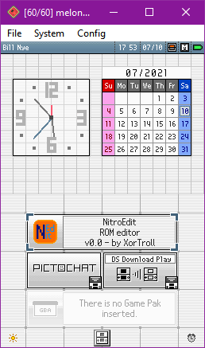
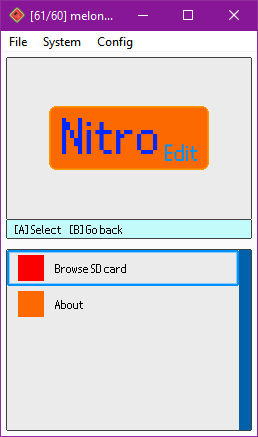
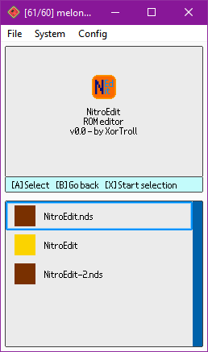
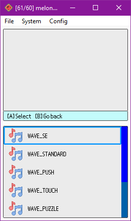
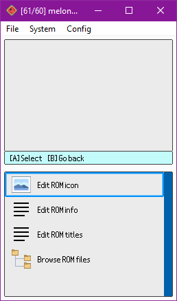

# NitroEdit

> NDS(i) ROM editor for the Nintendo DS(i) consoles themselves

NitroEdit is a NDS(i) ROM editor for the Nintendo DS(i) consoles themselves, which can be used in flashcarts, TwilightMenu, etc. to make custom edits of ROMs with the simplicity and the portability of this console family.

NitroEdit is the result of bringing the concept of already existing Nintendo DS(i) ROM editors to the DS(i) consoles themselves.

While it's still a work-in-progress project, it's quite close for an initial release with some basic features.

Any suggestions, ideas and contributions are always welcome.

## Supported formats

### NDS(i) ROMs

- View/edit info (game title, game code, maker code)

- View/edit icon

- Browse it's NitroFs filesystem

### Archives (NARC, CARC, etc.)

- Browse it's NitroFs filesystem

### NCGR, NCLR, NSCR

- View/edit the texture formed by NCGR + NCLR

- View the texture formed by a NCGR + NCLR + NSCR (saving is not supported yet)

### SDAT

- Explore wave archives (SWAR) and their wave samples

- Play/edit those wave samples (SWAV), recording with the console's microphone!

### BMG

- View/edit it's strings

## Building

- Like with most DS(i) homebrew projects, this project basically requires devkitARM, libnds and libfat to be installed. Then, executing `make` will compile the project into an executable NDS file.

## TODO / known issues

- Move from temporary graphics to proper ones

- Improve loading/saving times, can't do much better due to technical limitations existing ROM editors don't have...

- Detect file formats with a better system than just checking the extension (checking headers, etc.)

- Implement zoom for large textures in the graphic editor

- Allow changing colors in the color palette in the graphic editor

- Implement saving texture as NCGR+NCLR+NSCR

- Support other formats within SDATs (STRM, SSEQ, etc.)

- Models and model textures (NSBMD, NSBTX), maybe support editing those textures at least?

- Implement utility.bin support (contains a filesystem inside)

- For multiple palette NCGR+NCLR textures, allow choosing the palette to load

- Improve menu code (flickering can get annoying)

- Support ignored attributes in NSCR data (check the links credited below)

- Support PMCP section in NCLRs

- Add hex/text editors/viewers?

- File exporting and importing support from NitroFs filesystems?

- Support more special characters (é, à, etc.) on the keyboard.

- Improve LZ77 (de)compression? Currently using a ported implementation from C#, there might be more optimal implementations out there...

## Credits

- [devkitPro](https://github.com/devkitPro)'s devkitARM, libnds and libfat are the basic components in order to make this project and most other DS(i) homebrew projects.

- Some already existing ROM editors were really helpful in order to understand several file formats and LZ77 (de)compression: [Every File Explorer](https://github.com/Gericom/EveryFileExplorer), [NSMBe5](https://github.com/Dirbaio/NSMB-Editor), [MKDS Course Modifier](https://www.romhacking.net/utilities/1285/) and [DS Sound Studio](https://dswiki.garhoogin.com/page.jsp?name=DS%20Sound%20Studio)

- The following web pages were also really helpful in order to understand several file formats: https://www.romhacking.net/documents/%5b469%5dnds_formats.htm, http://www.feshrine.net/hacking/doc/nds-sdat.html

- This project uses [lodepng](https://github.com/lvandeve/lodepng) and [stb-truetype](https://github.com/nothings/stb/blob/master/stb_truetype.h) to support loading PNG and TTF files respectively.

- This project makes use of a non-official TTF of the Nintendo DS(i)'s BIOS font, available here: https://www.dafont.com/nintendo-ds-bios.font