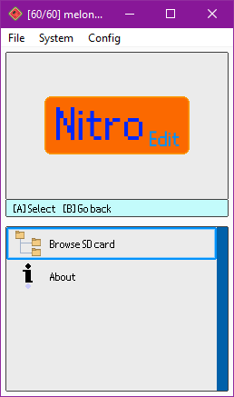
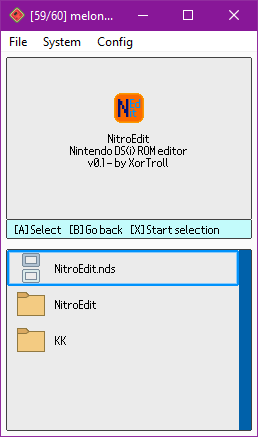
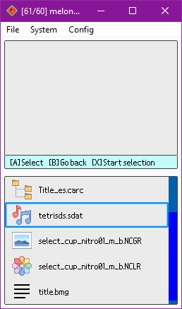
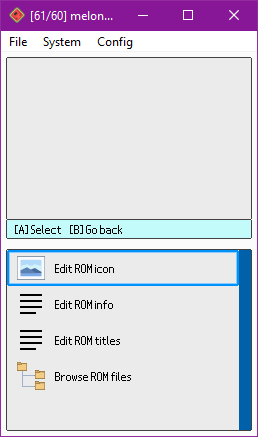
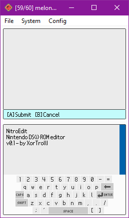
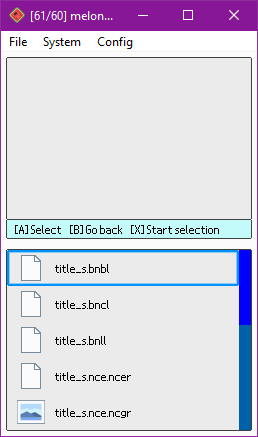

# NitroEdit

> C++ libraries and various tools for NDS(i) ROM/file editing: PC tools and an editor for the Nintendo DS(i) consoles themselves

- [NitroEdit](#nitroedit)
  - [libnedit (C++ libraries)](#libnedit-c-libraries)
  - [NitroEdit (NDS(i) ROM editor)](#nitroedit-ndsi-rom-editor)
    - [DS version](#ds-version)
    - [PC version](#pc-version)
  - [Supported formats](#supported-formats)
    - [NDS(i) ROMs](#ndsi-roms)
    - [Archives (NARC, CARC, DWC utility files, etc.)](#archives-narc-carc-dwc-utility-files-etc)
    - [NCGR, NCLR, NSCR](#ncgr-nclr-nscr)
    - [SDAT (plus SWAR, SWAV)](#sdat-plus-swar-swav)
    - [BMG](#bmg)
  - [Building](#building)
    - [libnedit](#libnedit)
    - [NitroEdit (DS)](#nitroedit-ds)
    - [NitroEdit (PC)](#nitroedit-pc)
  - [TODO](#todo)
    - [libnedit](#libnedit-1)
    - [NitroEdit (DS)](#nitroedit-ds-1)
    - [NitroEdit (PC)](#nitroedit-pc-1)
  - [Support](#support)
  - [Credits](#credits)

## libnedit (C++ libraries)

The `libnedit` libraries are the core component of all the tools within this project.

While the libraries are not documented yet, one can check at the tools as examples (better to use the PC tools for reference since they're simpler than NitroEdit).

Note that these code is highly optimized (thus some saving/etc will probably be slow) since it is expected to work properly in a Nintendo DS(i) console.

## NitroEdit (NDS(i) ROM editor)

NitroEdit is the shared name for two DS(i) ROM editors, one as a desktop tool (like usual ROM editors) and another one to be used from a DS(i) console itself (in flashcarts, TwilightMenu, etc.)

### DS version

The DS version of NitroEdit is the result of bringing the concept of already existing Nintendo DS(i) ROM editors to the DS(i) consoles themselves. Despite obvious limitations, one can make custom edits of ROMs with the simplicity and the portability of this console family.

While it's still a work-in-progress project, it's quite close for an initial release with some basic features.

### PC version

> TODO

## Supported formats

### NDS(i) ROMs

- View/edit info (game title, game code, maker code)

- View/edit icon

- Browse it's NitroFs filesystem

### Archives (NARC, CARC, DWC utility files, etc.)

- Browse it's NitroFs filesystem

### NCGR, NCLR, NSCR

- View/edit the texture formed by NCGR + NCLR

- View the texture formed by a NCGR + NCLR + NSCR (saving is not supported yet)

### SDAT (plus SWAR, SWAV)

- Explore wave archives (SWAR) and their wave samples

- Play/edit those wave samples (SWAV), recording with the console's microphone!

### BMG

- View/edit strings

## Building

### libnedit

These libraries have basically no dependencies and can easily be embedded in any C/C++ project.

### NitroEdit (DS)

Like with most DS(i) homebrew projects, this project basically requires devkitARM, libnds and libfat to be installed. Then, executing `make` will compile the project into an executable NDS file.

### NitroEdit (PC)

> TODO

## TODO

### libnedit

- Improve loading/saving times, can't do much better due to technical limitations existing ROM editors don't have...

- Implement saving texture as NCGR+NCLR+NSCR

- Implement saving in utility.bin files

- Support other formats within SDATs (STRM, SSEQ, etc.)

- Models and model textures (NSBMD, NSBTX), maybe support editing those textures at least?

- Support for remaining BMG message encodings

- Proper BMG escape support for messages using it

- For multiple palette NCGR+NCLR textures, allow choosing the palette to load

- Support ignored attributes in NSCR data (check the links credited below)

- Support PMCP section in NCLRs

### NitroEdit (DS)

- Polish graphics

- Detect file formats with a better system than just checking the extension (checking headers, etc.) (done in libnedit)

- Implement zoom for large textures in the graphic editor

- Allow changing colors in the color palette in the graphic editor

- Add hex/text editors/viewers?

- File exporting and importing support from NitroFs filesystems?

- Support more special characters (é, à, etc.) on the keyboard.

### NitroEdit (PC)

> TODO: make TODO list

## Support

Any suggestions, ideas and contributions are always welcome ;)

## Credits

- [devkitPro](https://github.com/devkitPro)'s devkitARM, libnds and libfat are the basic components in order to make this project and most other DS(i) homebrew projects.

- Some already existing ROM editors were really helpful in order to understand several file formats: [Every File Explorer](https://github.com/Gericom/EveryFileExplorer), [NSMBe5](https://github.com/Dirbaio/NSMB-Editor), [MKDS Course Modifier](https://www.romhacking.net/utilities/1285/) and [DS Sound Studio](https://dswiki.garhoogin.com/page.jsp?name=DS%20Sound%20Studio)

- The following web pages were also really helpful in order to understand several file formats:
  - https://www.romhacking.net/documents/%5b469%5dnds_formats.htm
  - http://www.feshrine.net/hacking/doc/nds-sdat.html
  - http://problemkaputt.de/gbatek.htm

- The [nintendo-lz](https://gitlab.com/DarkKirb/nintendo-lz) Rust crate was really helpful in order to understand and implement LZ10/LZ11 compression formats in C++.

- NitroEdit uses [lodepng](https://github.com/lvandeve/lodepng) and [stb-truetype](https://github.com/nothings/stb/blob/master/stb_truetype.h) libraries to support loading PNG and TTF files respectively.

- NitroEdit makes use of a non-official TTF of the Nintendo DS(i)'s BIOS font, available here: https://www.dafont.com/nintendo-ds-bios.font

- NitroEdit's UI icons were mostly grabbed from [Icons8](https://icons8.com/).

- The PC tools use [args](https://github.com/Taywee/args) libraries to parse command-line arguments.