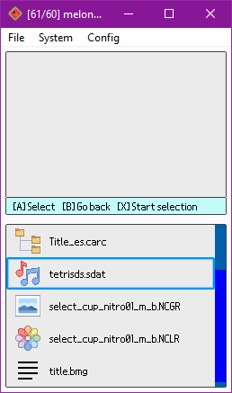
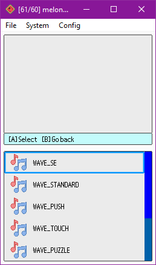
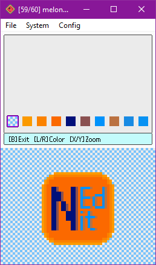

# NitroEdit

> C++ libraries and various tools for NDS(i) ROM/file editing: PC cmd-line tools and an editor for the Nintendo DS(i) consoles themselves, screenshots below

- [NitroEdit](#nitroedit)
  - [libnedit (C++ libraries)](#libnedit-c-libraries)
  - [NitroEdit (NDS(i) ROM editor)](#nitroedit-ndsi-rom-editor)
    - [Supported formats](#supported-formats)
      - [NDS(i) ROMs](#ndsi-roms)
      - [Archives (NARC, CARC, etc.)](#archives-narc-carc-etc)
      - [NCGR, NCLR, NSCR](#ncgr-nclr-nscr)
      - [SDAT](#sdat)
      - [BMG](#bmg)
    - [Building](#building)
  - [PC tools (cmd-line)](#pc-tools-cmd-line)
    - [BmgUtil](#bmgutil)
  - [TODO](#todo)
    - [libnedit](#libnedit)
    - [NitroEdit](#nitroedit-1)
    - [PC tools](#pc-tools)
  - [Credits](#credits)

## libnedit (C++ libraries)

The `libnedit` libraries are the core component of all the tools within this project.

While the libraries are not documented yet, one can check at the tools as examples (better to use the PC tools for reference since they're simpler than NitroEdit).

Note that these code is highly optimized (thus some saving/etc will probably be slow) since it is expected to work properly in a Nintendo DS(i) console.

## NitroEdit (NDS(i) ROM editor)

NitroEdit is a NDS(i) ROM editor for the Nintendo DS(i) consoles themselves, which can be used in flashcarts, TwilightMenu, etc. to make custom edits of ROMs with the simplicity and the portability of this console family.

NitroEdit is the result of bringing the concept of already existing Nintendo DS(i) ROM editors to the DS(i) consoles themselves.

While it's still a work-in-progress project, it's quite close for an initial release with some basic features.

Any suggestions, ideas and contributions are always welcome.

### Supported formats

#### NDS(i) ROMs

- View/edit info (game title, game code, maker code)

- View/edit icon

- Browse it's NitroFs filesystem

#### Archives (NARC, CARC, etc.)

- Browse it's NitroFs filesystem

#### NCGR, NCLR, NSCR

- View/edit the texture formed by NCGR + NCLR

- View the texture formed by a NCGR + NCLR + NSCR (saving is not supported yet)

#### SDAT

- Explore wave archives (SWAR) and their wave samples

- Play/edit those wave samples (SWAV), recording with the console's microphone!

#### BMG

- View/edit it's strings

### Building

- Like with most DS(i) homebrew projects, this project basically requires devkitARM, libnds and libfat to be installed. Then, executing `make` will compile the project into an executable NDS file.

## PC tools (cmd-line)

These are simpler tools which deal with different file formats:

### BmgUtil

Supports listing BMG strings.

## TODO

### libnedit

- Improve loading/saving times, can't do much better due to technical limitations existing ROM editors don't have...

- Implement saving texture as NCGR+NCLR+NSCR

- Support other formats within SDATs (STRM, SSEQ, etc.)

- Models and model textures (NSBMD, NSBTX), maybe support editing those textures at least?

- Implement utility.bin support (contains a filesystem inside)

- For multiple palette NCGR+NCLR textures, allow choosing the palette to load

- Support ignored attributes in NSCR data (check the links credited below)

- Support PMCP section in NCLRs

- Improve LZ77 (de)compression? Currently using a ported implementation from C#, there might be more optimal implementations out there...

### NitroEdit

- Polish graphics

- Detect file formats with a better system than just checking the extension (checking headers, etc.)

- Implement zoom for large textures in the graphic editor

- Allow changing colors in the color palette in the graphic editor

- Add hex/text editors/viewers?

- File exporting and importing support from NitroFs filesystems?

- Support more special characters (é, à, etc.) on the keyboard.

### PC tools

- Make more ;)

## Credits

- [devkitPro](https://github.com/devkitPro)'s devkitARM, libnds and libfat are the basic components in order to make this project and most other DS(i) homebrew projects.

- Some already existing ROM editors were really helpful in order to understand several file formats and LZ77 (de)compression: [Every File Explorer](https://github.com/Gericom/EveryFileExplorer), [NSMBe5](https://github.com/Dirbaio/NSMB-Editor), [MKDS Course Modifier](https://www.romhacking.net/utilities/1285/) and [DS Sound Studio](https://dswiki.garhoogin.com/page.jsp?name=DS%20Sound%20Studio)

- The following web pages were also really helpful in order to understand several file formats: https://www.romhacking.net/documents/%5b469%5dnds_formats.htm, http://www.feshrine.net/hacking/doc/nds-sdat.html

- NitroEdit uses [lodepng](https://github.com/lvandeve/lodepng) and [stb-truetype](https://github.com/nothings/stb/blob/master/stb_truetype.h) libraries to support loading PNG and TTF files respectively.

- NitroEdit makes use of a non-official TTF of the Nintendo DS(i)'s BIOS font, available here: https://www.dafont.com/nintendo-ds-bios.font

- NitroEdit's UI icons were mostly grabbed from [Icons8](https://icons8.com/).

- The PC tools use [args](https://github.com/Taywee/args) libraries to parse command-line arguments.